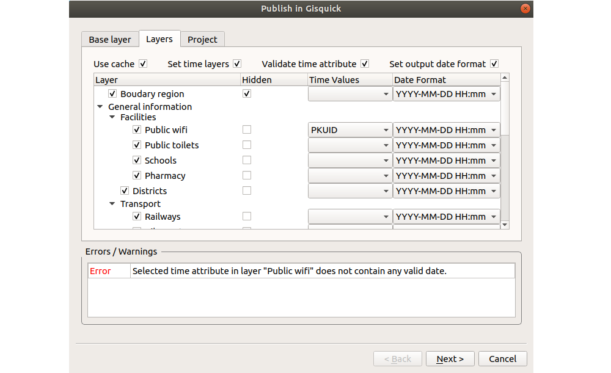
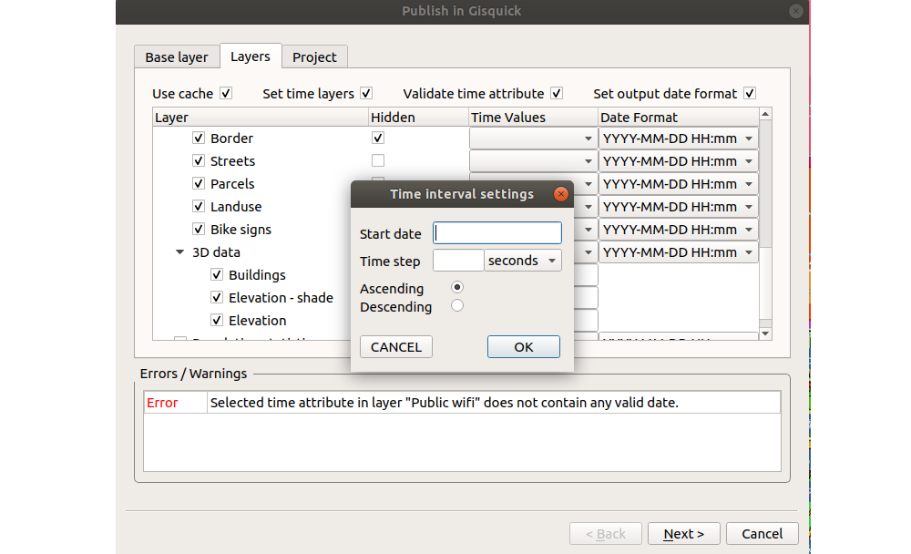

# GSoC 2018 project 

# 'Extension of Gisquick platform filtering tool based on raster and vector spatio-temporal data'

The main goal of this project is extend a basic filtering tool that was being developed as a part of my final thesis. Originaly it is focused on spatio-temporal vector data filtering only. This project focuses on support for general spatio-temporal both vector and raster data, as well as other functionalities that will make it easy to handle by every client and make the data publishing more effective. 

This repository contains Gisquick plugin for QGIS. Latest version supports publication of raster and vector data. Simple settings of time layers together with time data validation is done in just one wizard page. 

<b>Publication wizard with vector layers</b>

<b>Publication wizard with raster layers</b>

# Gisquick QGIS Plugin

QGIS plugin for publishing your QGIS projects in Gisquick web-based
publishing platform. Gisquick (<a
href="http://gisquick.org">http://gisquick.org</a>) is designed as an
open source platform for publishing geospatial data in the sense of
rapid sharing QGIS projects on the web. See <a
href="http://gisquick.readthedocs.io">http://gisquick.readthedocs.io</a>
for more info.

## Authors (of this plugin)
 * Marcel Dancak, dancakm@gmail.com

## Contributors (alphabetical order)
 * Martin Landa, landa.martin@gmail.com
